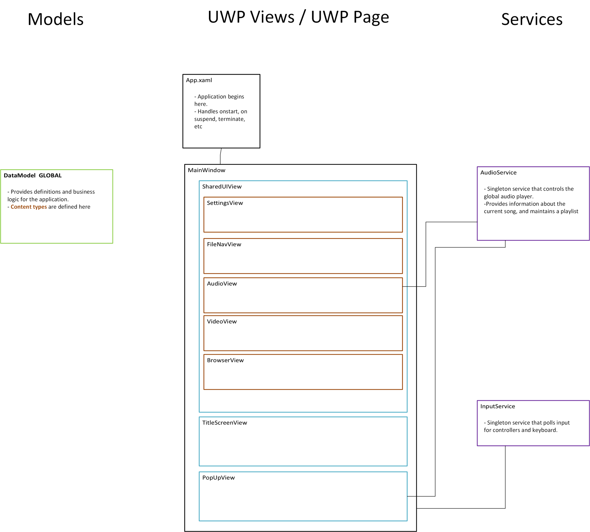

# MultiExecutable Package Sample

## Description
This sample is a media viewer that enables a user to interact and view media files. Files provided to the sample are handled differently depending on their extension. For example, PDF's and images are displayed in a webview2 where as audio is added to a global playlist that can be played throughout the application. 

### How to use

Paste all of your media files into the DigitalContent Folder.  Then build the project. 

You can generate a package through VS.
[Packaging MSIX apps - MSIX | Microsoft Learn](https://learn.microsoft.com/en-us/windows/msix/package/packaging-uwp-apps#generate-an-app-package)

#### Controls
You can press shift on keyboard or up on the dpad to access a pop up window for the current audio track if there is any.

# Detailed Layout

### Data model

Maintains an interface “Content”
Content represents any files/directories that can be clicked within a directory. Clicking on one creates/navigates to a new frame.
All content has
1. Name
2. Path
3. View to display the content
    - For example, you could set up Wav and mp3 files to fall under AudioContent
### Top Level Views

#### MainWindow

The MainWindow is the main window of the application. It encapsulates the whole application and contains a Frame for navigating between different pages and a Popup for displaying pop-up content.

#### PopUpView

The PopUpView is a user control that can be displayed as a pop-up in the application. It can be activated by a global key. It contains controls for media playback, including buttons for rewind, play/pause, and fast-forward, and a text box for displaying the current song title.

#### SharedUIView

The SharedUIView is the main container for the application's default experience loop. It contains a NavigationView for navigating between different sections of the application and a Frame for displaying the content of the current section. It also maintains the **Navigation stack**. All content specific views are displayed within this view.

#### TitleScreenView

The TitleScreenView displays the landing page of the application once its loaded.

### Content Views:

#### FileNavView

Displays a list of clickable Content items. This view is displayed when a **directory content** is clicked

#### BrowserView

Displays web content using a WebView2 control. This view is displayed when an **image or PDF** is clicked

#### VideoView

Plays video content using a MediaPlayerElement control. This view is displayed when a **video** **content** is clicked

#### AudioView

Plays audio content using a MediaPlayerElement control. This view is displayed when an **audio content** is clicked. Audio in this view is synced with the AudioService.

### Services

#### InputService

The InputService is responsible for handling user input in the application. It uses a DispatcherTimer to poll for input at regular intervals. It supports both keyboard and gamepad input.

#### AudioService

The AudioService is responsible for managing audio playback in the application. It uses a MediaPlayer to play audio. It allows audio playback in the background.

## Development example:
If you want to add your own custom page/view for a specific type of file, you would.

### Create your page to view the custom content.
1. Go to the solution explorer and ADD a blank page, this generates a UWP .xaml page and a .xaml.cs code-behind.

### Create your content type
1. Go to DataModel.cs, and add your  new content type. It should extend the Content class.
    - The type passed into the constructor is the class of the xaml page. You can find the class definition in the xaml.cs file
2. Add your ContentType to the CreateContent(...) function.
3. Add your desired mapping(s) to the Extension map in the Constructor.

